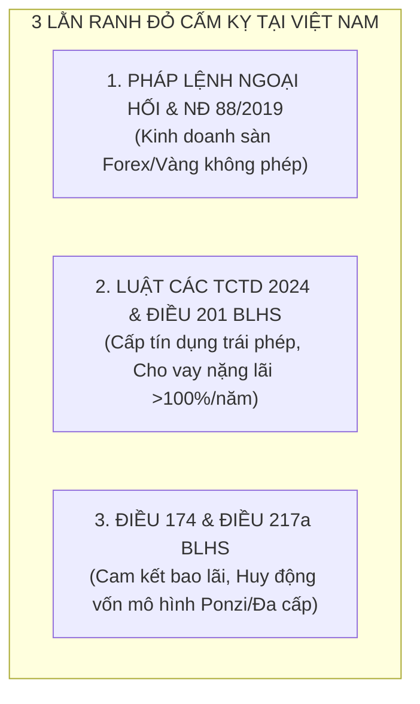
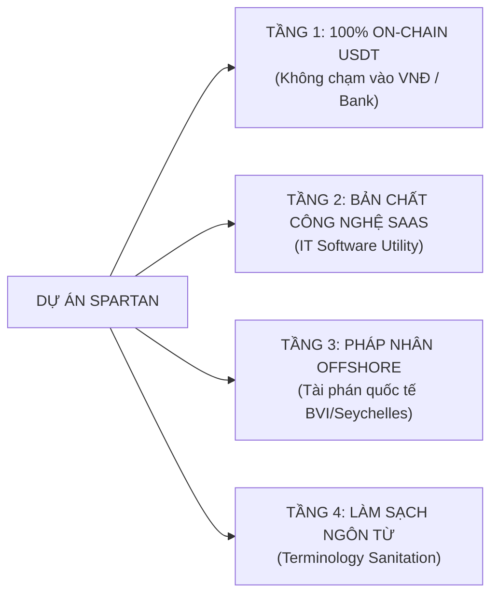

# KHUNG PHÁP LÝ & QUY CHUẨN TUÂN THỦ PHÁT TRIỂN ỨNG DỤNG FINTECH SPARTAN
**(SPARTAN LEGAL COMPLIANCE & REGULATORY ARCHITECTURE MASTER FRAMEWORK)**  
*Tài liệu kim chỉ nam và quy chuẩn bắt buộc áp dụng cho toàn bộ hoạt động R&D, thiết kế giao diện, lập trình mã nguồn, truyền thông và vận hành dự án.*

---

**Mã tài liệu:** `SPARTAN-LEGAL-MASTER-2026-V1`  
**Cấp độ bảo mật:** Tối Mật / Nội Bộ Ban Quản Trị (Confidential - Board & Core Dev Only)  
**Hiệu lực thi hành:** Vĩnh viễn (Bắt đầu từ ngày 03/09/2026)  
**Chủ biên:** Hội đồng Quản trị, Chief Legal Officer (CLO) & Chief Executive Officer (CEO)  

---

## MỤC LỤC CHIẾN LƯỢC
1. [I. NGUYÊN TẮC CỐT LÕI & LẰN RANH ĐỎ PHÁP LUẬT VIỆT NAM](#i-nguyên-tắc-cốt-lõi--lằn-ranh-đỏ-pháp-luật-việt-nam)
2. [II. HỌC THUYẾT BỘ GIÁP PHÁP LÝ 4 TẦNG (THE 4-LAYER LEGAL SHIELD)](#ii-học-thuyết-bộ-giáp-pháp-lý-4-tầng-the-4-layer-legal-shield)
3. [III. BỘ TỪ ĐIỂN LÀM SẠCH NGÔN TỪ (CLEAN-LEXICON / BLACKLIST & WHITELIST)](#iii-bộ-từ-điển-làm-sạch-ngôn-từ-clean-lexicon--blacklist--whitelist)
4. [IV. QUY CHUẨN KỸ THUẬT & GIAO DIỆN BẮT BUỘC KHI LẬP TRÌNH](#iv-quy-chuẩn-kỹ-thuật--giao-diện-bắt-buộc-khi-lập-trình)
5. [V. BẢN MẪU ĐIỀU KHOẢN DỊCH VỤ & MIỄN TRỪ TRÁCH NHIỆM (STANDARD TOS & DISCLAIMER)](#v-bản-mẫu-điều-khoản-dịch-vụ--miễn-trừ-trách-nhiệm-standard-tos--disclaimer)
6. [VI. QUY TRÌNH ỨNG PHÓ KHỦNG HOẢNG & TRUYỀN THÔNG (CRISIS PROTOCOL)](#vi-quy-trình-ứng-phó-khủng-hoảng--truyền-thông-crisis-protocol)

---

## I. NGUYÊN TẮC CỐT LÕI & LẰN RANH ĐỎ PHÁP LUẬT VIỆT NAM

> [!IMPORTANT]
> **TIÊU CHÍ SỐNG CÒN CỦA DỰ ÁN:**  
> Spartan không tìm cách "lách luật một cách nghiệp dư", mà vận hành theo cấu trúc **Công Nghệ Xuyên Biên Giới (Cross-Border SaaS)** đã được chuẩn hóa bởi các tập đoàn FinTech kỳ lân thế giới (như Binance, TradingView, Bybit, Exness).  
> Mọi tính năng lập trình và mọi dòng chữ hiển thị trên Mini App đều phải đứng ngoài phạm vi điều chỉnh trực tiếp của luật pháp hình sự Việt Nam.

### 3 Lằn Ranh Đỏ Cấm Kỵ Của Pháp Luật Việt Nam:



1. **Lằn Ranh 1 - Không Mở Sàn Giao Dịch Ngoại Hối / Vàng Trong Nước:**
   - *Luật định:* Nhà nước độc quyền quản lý ngoại hối và vàng miếng. Cá nhân/doanh nghiệp không được cấp phép mở sàn giao dịch hoặc môi giới phái sinh tài chính tại Việt Nam.
   - *Quy chuẩn Spartan:* Spartan **tuyệt đối không nhận tiền để tự tạo sàn khớp lệnh**. Spartan chỉ là **phần mềm kết nối API (EA Interface)** tới sàn quốc tế Exness (do khách hàng tự mở tài khoản cá nhân).
2. **Lằn Ranh 2 - Không Hoạt Động Cho Vay Tín Dụng Nặng Lãi:**
   - *Luật định:* Điều 468 Bộ luật Dân sự 2015 khống chế trần lãi suất thỏa thuận $\le 20\%$/năm. Điều 201 BLHS xử lý hình sự cho vay lãi suất gấp 5 lần trần dân sự ($> 100\%$/năm).
   - *Quy chuẩn Spartan:* Tách bạch cấu trúc biểu phí: Lãi suất cơ bản trong hạn mức thỏa thuận dân sự ($< 20\%$/năm), phần còn lại được cấu trúc dưới dạng **"Phí Duy Trì Dịch Vụ Công Nghệ & Quản Trị Ký Quỹ"**.
3. **Lằn Ranh 3 - Tuyệt Đối Không "Cam Kết Bao Lãi" (No Guaranteed Profit):**
   - *Luật định:* Hành vi cam kết trả lãi cố định không rủi ro khi huy động tiền là căn cứ hàng đầu để cơ quan điều tra khởi tố tội Lừa đảo chiếm đoạt tài sản (Điều 174 BLHS).
   - *Quy chuẩn Spartan:* **Bắt buộc 100% người dùng phải bấm ký số điện tử bản Risk Disclosure Agreement** xác nhận hiểu rõ rủi ro biến động thị trường trước khi kích hoạt bot.

---

## II. HỌC THUYẾT BỘ GIÁP PHÁP LÝ 4 TẦNG (THE 4-LAYER LEGAL SHIELD)

Để dự án vĩnh viễn miễn nhiễm với các rủi ro pháp lý, bất kỳ tính năng mới nào được phát triển trong tương lai đều phải vượt qua bài kiểm tra của 4 tầng bảo vệ:



### 1. Tầng 1: 100% On-Chain USDT (Không chạm vào hệ thống Ngân hàng VNĐ)
- Mọi luồng tiền nạp, rút, trả phí, hoa hồng, thế chấp trong Mini App **chỉ sử dụng duy nhất đồng ổn định USDT (TRC20 / BEP20)**.
- Không tích hợp bất kỳ cổng thanh toán VNĐ nào (như Momo, ZaloPay, Vietcombank, QR Napas).
- **Hệ quả pháp lý:** Không có sao kê ngân hàng Việt Nam, không có giao dịch tiền pháp định VNĐ. Nhà nước hiện chưa có luật cấm sở hữu tài sản kỹ thuật số cá nhân.

### 2. Tầng 2: Bản Chất Công Nghệ SaaS (Software as a Service)
- Spartan được định danh pháp lý là **Công cụ phần mềm giao diện người dùng (User Interface Automation Tool)**.
- Người dùng không ủy thác tiền cho Spartan. Tiền vốn trade của người dùng nằm trên tài khoản cá nhân tại sàn Exness ECN quốc tế.
- Spartan chỉ thu **"Phí Bản Quyền Phần Mềm & Phí Hạ Tầng Điện Toán Đám Mây"**.

### 3. Tầng 3: Pháp Nhân Quốc Tế Xuyên Biên Giới (Offshore Holding)
- Khi quy mô mở rộng trên 100 khách hàng, thành lập một công ty vỏ bọc công nghệ (International Business Company - IBC) tại **Seychelles, British Virgin Islands (BVI) hoặc Dubai DMCC**.
- Mini App là sản phẩm của công ty Offshore cung cấp dịch vụ trực tuyến toàn cầu.
- Toàn bộ Điều khoản Dịch vụ (Terms of Service) quy định rõ: **Tranh chấp nếu có sẽ được giải quyết bằng Trọng tài Thương mại Quốc tế tại Singapore (SIAC)**. Cơ quan hành chính trong nước không có thẩm quyền chế tài.

### 4. Tầng 4: Bộ Từ Điển Làm Sạch Ngôn Từ (Terminology Sanitation)
- Bất kỳ lập trình viên nào khi viết code, tạo API, viết chữ trên UI đều phải tra cứu danh mục Từ Ngữ Hợp Lệ dưới đây.

---

## III. BỘ TỪ ĐIỂN LÀM SẠCH NGÔN TỪ (CLEAN-LEXICON)

Quy định bắt buộc: **NGHIÊM CẤM** sử dụng các từ ngữ thuộc Cột Đen (Blacklist). Phải thay thế 100% bằng Cột Trắng (Whitelist).

| Lĩnh Vực | ❌ CỘT ĐEN: TỪ NGỮ BỊ CẤM TRÊN UI/CODE | ✅ CỘT TRẮNG: TỪ NGỮ HỢP LỆ QUỐC TẾ |
| :--- | :--- | :--- |
| **Vay vốn** | Cho vay tiền, Vay nợ, Tín dụng, Vay lãi | **Hỗ Trợ Thanh Khoản Ký Quỹ (Margin Liquidity Protocol)** |
| **Lãi suất vay** | Tiền lãi, Lãi suất 2.5%/tháng, Cắt cổ | **Phí Duy Trì Dịch Vụ Công Nghệ & Quản Trị Rủi Ro** |
| **Thế chấp** | Cầm đồ, Cầm cố tài sản, Xiết nợ | **Khóa Ký Quỹ An Toàn (Smart Collateral Escrow Lock)** |
| **Gửi tiền** | Gửi tiết kiệm, Đầu tư sinh lời, Nhận vốn | **Cấp Thanh Khoản Giao Thức (Provide Protocol Liquidity)** |
| **Bot Trade** | Sàn Vàng, Đánh Forex, Ủy thác đầu tư | **Công Cụ Phân Tích & Tự Động Hóa Thuật Toán (EA Utility)** |
| **Lợi nhuận** | Cam kết lãi, Bao lỗ, Trả lãi hàng ngày | **Hiệu Suất Lịch Sử Mô Phỏng (Simulated Past Performance)** |
| **Thanh lý** | Tịch thu tài sản, Bán tháo | **Tự Động Cân Bằng Thanh Khoản (Auto-Balancing Protocol)** |
| **Đại lý** | Hoa hồng đa cấp, Cấp bậc tuyến dưới | **Chương Trình Đối Tác Giới Thiệu Hạ Tầng (Affiliate Partner)** |

---

## IV. QUY CHUẨN KỸ THUẬT & GIAO DIỆN BẮT BUỘC KHI LẬP TRÌNH

Mọi kỹ sư phần mềm khi commit code vào repository phải tuân thủ 5 quy chuẩn kỹ thuật sau:

### 1. Quy Chuẩn Ký Số Điện Tử Bắt Buộc (Mandatory Electronic Signature)
- Trước khi người dùng được phép tạo đơn nạp tiền đầu tiên, hệ thống **bắt buộc phải hiển thị Modal [Thỏa Thuận Chấp Thuận Rủi Ro (Risk Disclosure Agreement)]**.
- Người dùng phải nhập mã PIN bảo mật cá nhân để ký số SHA-256 xác thực. Dữ liệu này phải được lưu trữ bất biến (Immutable) trên Firestore kèm: `telegramId`, `timestamp`, `signatureHash`, `clientIp`.

### 2. Quy Chuẩn Cơ Cấu Biểu Phí Trên Hệ Thống (`feeCalculator.ts`)
- Khi tính toán khoản thu từ tính năng hỗ trợ thanh khoản P2P:
  - Tỷ lệ hiển thị là **Phí Dịch Vụ Tổng Hợp (Integrated Service Fee)**.
  - Về mặt cấu trúc hạch toán nội bộ: Tách thành **Lãi suất định mức thỏa thuận dân sự (1.5%/tháng $\approx$ 18%/năm $\le$ Trần 20% của Bộ luật Dân sự)** + **Phí Dịch Vụ Nền Tảng Công Nghệ (0.5% – 1.0%/tháng)**.
  - Bằng cách phân tách này, tỷ lệ lãi suất danh nghĩa **luôn luôn nằm dưới trần 20%/năm**, hoàn toàn triệt tiêu nguy cơ vi phạm Điều 201 Bộ luật Hình sự.

### 3. Quy Chuẩn Độc Lập Tài Khoản & Ví Nóng/Lạnh
- Ví lưu ký của Quỹ Admin phải phân tách rõ ràng:
  - **Ví Nóng (Hot Wallet):** Chỉ chứa tối đa 10% vốn để phục vụ nạp/rút tức thì.
  - **Ví Lạnh Ký Quỹ Đa Chữ Ký (Multi-Sig Vault):** Chứa 90% vốn dự phòng, bảo vệ trước nguy cơ tấn công mạng.

---

## V. BẢN MẪU ĐIỀU KHOẢN DỊCH VỤ & MIỄN TRỪ TRÁCH NHIỆM (STANDARD TOS & DISCLAIMER)

Đoạn văn bản sau đây được cấu hình hiển thị tại Footer của Mini App và trong trang Xác Nhận Rủi Ro:

```markdown
### ĐIỀU KHOẢN DỊCH VỤ & TUYÊN BỐ MIỄN TRỪ TRÁCH NHIỆM QUỐC TẾ
1. **Bản Chất Dịch Vụ:** Ứng dụng Spartan là một giao diện phần mềm công nghệ độc lập, cung cấp công cụ phân tích dữ liệu thuật toán và hỗ trợ điều phối thanh khoản kỹ thuật số phi tập trung. Spartan không phải là tổ chức tín dụng, không phải quỹ quản lý ủy thác tài sản và không cung cấp dịch vụ ngân hàng hay môi giới tài chính tại bất kỳ vùng lãnh thổ nào chưa được cấp phép.
2. **Trách Nhiệm Tài Sản Cá Nhân:** Người dùng hiểu rõ giao dịch tài sản tài chính tiềm ẩn rủi ro biến động giá cao. Mọi hoạt động giao dịch thông qua kết nối API sàn đối tác (Exness ECN) được thực hiện hoàn toàn dựa trên sự tự nguyện và quyết định cá nhân của người dùng. Hiệu suất giao dịch trong quá khứ không phải là cam kết cho kết quả trong tương lai.
3. **Tuân Thủ Pháp Luật Sở Tại:** Bằng việc tiếp tục sử dụng ứng dụng, người dùng xác nhận bản thân có đủ năng lực hành vi dân sự và cam kết tự chịu trách nhiệm tuân thủ toàn bộ các quy định pháp luật và nghĩa vụ thuế tại quốc gia cư trú của mình.
4. **Tài Phán Áp Dụng:** Mọi vấn đề phát sinh từ hoặc liên quan đến việc sử dụng phần mềm này được điều chỉnh và giải thích theo luật pháp quốc tế về dịch vụ công nghệ số, với cơ chế trọng tài thương mại độc lập.
```

---

## VI. QUY TRÌNH ỨNG PHÓ KHỦNG HOẢNG & TRUYỀN THÔNG (CRISIS PROTOCOL)

Khi xảy ra các tình huống khiếu nại của khách hàng hoặc sự cố thị trường:

1. **Nguyên Tắc 1 - Tuyệt Đối Không Tranh Cãi Bằng Ngôn Từ Tài Chính:**
   - Nếu khách hàng khiếu nại: Đội ngũ CSKH chỉ giải thích dựa trên **"Dữ liệu thông số kỹ thuật phần mềm"** (như độ trễ mạng, trượt giá của sàn quốc tế Exness, tham số thuật toán Stop-out). Không bao giờ dùng danh nghĩa cá nhân để thỏa thuận tiền bạc.
2. **Nguyên Tắc 2 - Kiểm Soát Nghiêm Ngặt Kênh Telegram:**
   - Bật chế độ chặn người dùng đăng số tài khoản ngân hàng Việt Nam lên nhóm chat.
   - Xóa ngay lập tức mọi bài đăng có từ ngữ nhạy cảm: "kèo bao lãi", "cam kết hoàn vốn", "cho vay tiền nhanh".
3. **Nguyên Tắc 3 - Cơ Chế Sandbox Khi Nhà Nước Ban Hành Luật Mới:**
   - Khi Ngân hàng Nhà nước Việt Nam chính thức ban hành Nghị định về Cơ chế thử nghiệm (Sandbox FinTech & Crypto Assets), Ban Quản Trị sẽ chủ động nộp hồ sơ xin cấp phép thí điểm dưới danh mục **Giải pháp Công nghệ Tài chính cho Giao dịch Cá nhân**.

---

## VII. LỜI KẾT & HIỆU LỰC

Tài liệu này được lưu trữ vĩnh viễn trên kho lưu trữ hệ thống và là **kim chỉ nam tối cao** cho toàn bộ quá trình mở rộng từ 50 khách đến 50,000 khách hàng. Miễn là Ban Quản Trị và đội ngũ kỹ thuật tuân thủ nghiêm ngặt khung kiến trúc này, Spartan sẽ phát triển vững chắc, bền vững và trường tồn như những chiến binh Sparta bất khả chiến bại! 👑🛡️⚡
